## 📊 Diagrama de Flujo – Bot de Trading (Estado Actual)

Esta documentación resume, a alto nivel, cómo fluye la información y qué módulos participan en cada etapa del sistema actual.

### 1) Visión global del sistema

```mermaid
flowchart LR
    A[DB: trading.historicaldata] --> B[core/features/indicator_calculator.py]
    B --> C[DB: trading.features]

    subgraph Entrenamiento Diario
      R[core/ml/training/daily_train/runner.py]
      R --> T[core/ml/training/train_direction.py]
      T --> AV[DB: trading.agentversions]
      R -->|si métrica supera umbral| P[Promoción]
      P --> AV
    end

    subgraph Inferencia/Planes
      AV --> IB[core/ml/inference/infer_bulk.py]
      IB --> AP[DB: trading.agentpreds]
      AP --> BP[core/ml/backtests/build_plans_from_signals.py]
      BP --> TP[DB: trading.tradeplans]
    end

    subgraph Decisiones y Ejecución (Training)
      DM[core/trading/decision_maker.py]
      AP --> DM
      DM --> TP
      TP --> OE[core/trading/order_executor.py]
      OE -->|simulación puntual| BT[core/ml/backtests/backtest_plans.py]
      OE --> TP
    end

    subgraph Backtests Históricos
      R -->|si hay ver_id promovido| BT
      BT --> BR[DB: trading.backtests / trades]
    end

    C -.-> T
    C -.-> IB
```

Notas:
- El runner orquesta entrenamiento, promoción condicional, inferencia, construcción de planes, ejecución simulada (training) y backtest histórico.
- La ejecución en training actualiza `trading.tradeplans` (status y `execution_data`), y el backtest histórico escribe en tablas de resultados agregadas.

### 2) Ciclo del `daily_train/runner.py`

```mermaid
flowchart TD
    S[Start ciclo] --> Cfg[Lee config/env + símbolos/TF]
    Cfg --> Cov{Auto-backfill activado?}
    Cov -- Sí --> CF[Verificar cobertura y backfillear faltantes]
    Cov -- No --> CR[Solo reportar cobertura]
    CF --> TR
    CR --> TR

    TR[Entrenar core/ml/training/train_direction.py] --> MET[Métricas (AUC/Brier/ACC)]
    MET --> PR{¿Supera umbrales dinámicos?}
    PR -- Sí --> PROM[Promover versión]
    PR -- No --> NextSym[Ir al siguiente símbolo/TF]

    PROM --> INF[Inferencia por ventana corta]
    INF --> PLAN[Construcción de planes]
    PLAN --> DM2[Decision Maker (procesa signals y valida planes)]
    DM2 --> EXEC[Ejecutar planes (training) con order_executor]
    EXEC --> BTEST[Backtest histórico completo]
    BTEST --> NextSym

    NextSym --> END{--once?}
    END -- Sí --> RES[Imprimir resumen de portfolio]
    END -- No --> WAIT[Esperar BT_RETRAIN_MINUTES] --> S
```

Puntos clave:
- Ejecución de planes (training) se hace tras generar planes. El PnL mostrado en consola es del ejecutor en memoria.
- El backtest histórico solo se ejecuta cuando hay versión promovida (`ver_id`).

### 3) Flujo de generación y ejecución de planes

```mermaid
sequenceDiagram
    participant AV as agentversions (promoted)
    participant INF as infer_bulk.py
    participant AP as agentpreds
    participant BP as build_plans_from_signals.py
    participant TP as tradeplans
    participant DM as decision_maker.py
    participant OE as order_executor.py (training)
    participant BT as backtest_plans.py

    AV->>INF: Cargar mejor modelo (ver_id)
    INF->>AP: Insertar predicciones recientes
    AP->>BP: Construir planes desde señales ML
    BP->>TP: UPSERT planes (status='planned')
    AP->>DM: Señales crudas (agentsignals)
    DM->>TP: Crear/validar planes via planner
    OE->>TP: Leer planned (y openable)
    OE->>BT: Simular ejecución puntual del plan
    OE->>TP: Marcar plan executed + execution_data
```



### 4) Tablas clave y qué deberías ver

- `trading.features`: features por símbolo/TF/timestamp
- `trading.agentversions`: versiones entrenadas (+promoted)
- `trading.agentpreds`: predicciones de inferencia masiva
- `trading.tradeplans`: planes con `status` (planned/executed) y `execution_data`
- `trading.backtests`, `trading.trades` (o tablas equivalentes): resultados de backtests históricos

### 5) Consultas útiles (pgAdmin4)

```sql
-- Planes ejecutados hoy
SELECT id, symbol, timeframe, status, executed_at,
       execution_data->>'avg_price'   AS avg_price,
       execution_data->>'filled_qty'  AS filled_qty,
       execution_data->>'fees'        AS fees
FROM trading.tradeplans
WHERE executed_at::date = CURRENT_DATE
ORDER BY executed_at DESC;

-- Últimas versiones entrenadas
SELECT symbol, timeframe, horizon, id, created_at, promoted,
       (metrics->>'auc')::numeric   AS auc,
       (metrics->>'brier')::numeric AS brier,
       (metrics->>'acc')::numeric   AS acc
FROM trading.agentversions
ORDER BY created_at DESC
LIMIT 30;

-- Predicciones recientes
SELECT symbol, timeframe, COUNT(*) AS preds_1h
FROM trading.agentpreds
WHERE created_at > NOW() - INTERVAL '1 hour'
GROUP BY symbol, timeframe
ORDER BY 1,2;

-- Backtests recientes (si hay promovidos)
SELECT symbol, timeframe, from_ts, to_ts, net_pnl, gross_pnl, fees, max_dd, created_at
FROM trading.backtests
WHERE created_at > NOW() - INTERVAL '1 day'
ORDER BY created_at DESC;
```

### 6) Detalle por funciones y accesos a BD

```mermaid
flowchart LR
    subgraph Decision Maker
      DM0[_load_recent_signals()] -->|SELECT trading.agentsignals| DM1[_analyze_market_conditions()]
      DM1 -->|SELECT trading.features (15m/1h/4h/1d)| DM2[_apply_multi_tf_confirmation()]
      DM2 --> DM3[_apply_signal_filters()]
      DM3 --> DM4[_validate_risk_constraints()]
      DM4 -->|balance_manager.adjust_leverage()| DM5[_execute_decisions()]
      DM5 -->|planner.plan_and_store() INSERT INTO trading.tradeplans| DM6[executor.execute_pending_plans()]
      DM6 -->|UPDATE trading.tradeplans (executed/execution_data)| OUT1[(DB)]
    end

    subgraph Order Executor
      OE0[_load_pending_plans()] -->|SELECT trading.tradeplans WHERE status IN ('planned','openable')| OE1[_execute_plan_training()]
      OE1 -->|simulate_symbol_tf()| OE2[backtest_plans.py]
      OE2 --> OE3[_update_plan_status()]
      OE3 -->|UPDATE trading.tradeplans SET executed_at, execution_data| OUT2[(DB)]
    end

    subgraph Backtests
      BT0[simulate_symbol_tf()] -->|lee OHLCV/features| BT1[(DB)]
      BT0 -->|INSERT resultados| BT2[(backtests/trades)]
    end
```

Resumen de funciones principales y BD:
- `decision_maker._load_recent_signals()` lee `trading.agentsignals`.
- `decision_maker._analyze_market_conditions()` lee `trading.features` por TF.
- `decision_maker._validate_risk_constraints()` usa `balance_manager.adjust_leverage()` y el balance del executor en memoria.
- `planner.plan_and_store()` inserta en `trading.tradeplans`.
- `order_executor._load_pending_plans()` lee `trading.tradeplans` (planned/openable).
- `order_executor._execute_plan_training()` utiliza `simulate_symbol_tf()` y luego actualiza `trading.tradeplans` con `execution_data`/`executed_at`.
- `backtest_plans.simulate_symbol_tf()` lee datos y guarda resultados en tablas de backtest.

### 7) Notas de operación

- Para dejar el ciclo en ejecución continua: `python -m core.ml.training.daily_train.runner`
- Para un ciclo único: `python -m core.ml.training.daily_train.runner --once`
- Desactivar auto-backfill: `BT_SKIP_BACKFILL=true`
- El resumen de portfolio en consola refleja el estado del ejecutor en memoria; los cambios de DB se ven en las tablas anteriores.

---

Última actualización: generada automáticamente por la integración de documentación del proyecto.


