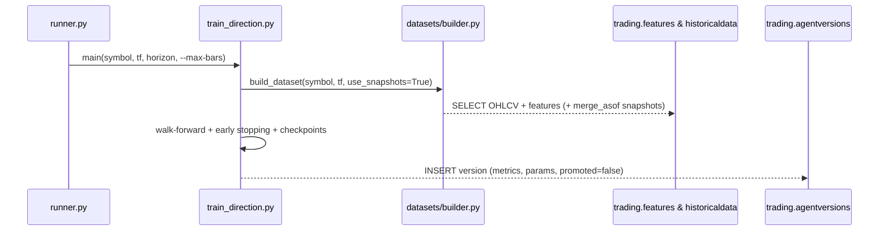
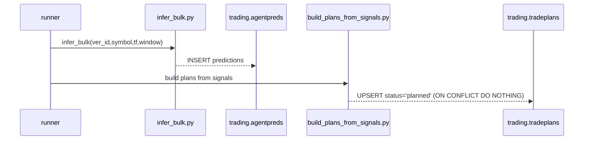
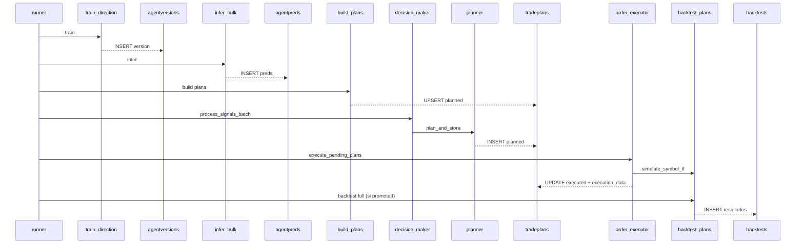

## 🧭 Diagrama Funcional – Llamadas, Funciones y Accesos a BD

Este documento es una vista “cableado interno” del bot: qué funciones llaman a cuáles, qué archivos participan y qué tablas se tocan en cada paso.

### 0) Leyenda rápida
- Caja redonda: función
- Caja rectangular: archivo/módulo
- Cilindro: tabla BD
- Flecha sólida: llamada directa
- Flecha punteada: lectura/escritura BD

### 1) Orquestación diaria – runner.py (alto nivel)
```mermaid
flowchart TD
    R[core/ml/training/daily_train/runner.py]
    subgraph Config
      WFT[_lookback_days()] --> R
      SYM[_symbols_tfs()] --> R
    end

    R -->|train| TRN[core/ml/training/train_direction.py]
    TRN -->|INSERT metrics| AV[(trading.agentversions)]
    R -->|promote_if_better| PRM[.promote.promote_if_better]
    PRM -->|UPDATE/SELECT| AV

    R -->|infer| INF[core/ml/inference/infer_bulk.py]
    INF -.->|INSERT| AP[(trading.agentpreds)]

    R -->|build plans| BPS[core/ml/backtests/build_plans_from_signals.py]
    BPS -.->|UPSERT| TP[(trading.tradeplans)]

    R -->|process signals| DM[core/trading/decision_maker.py]
    DM -.->|SELECT| ASIG[(trading.agentsignals)]
    DM -.->|SELECT| FEAT[(trading.features)]
    DM -->|planner.plan_and_store| PLN[core/trading/planner.py]
    PLN -.->|INSERT| TP

    R -->|execute training| OEX[core/trading/order_executor.py]
    OEX -.->|SELECT planned| TP
    OEX -->|simulate_symbol_tf| BT[core/ml/backtests/backtest_plans.py]
    BT -.->|leer OHLCV/features| FEAT
    OEX -.->|UPDATE executed| TP

    R -->|backtest full| BT
    BT -.->|INSERT resultados| BTR[(trading.backtests)]
```

### 2) Entrenamiento – train_direction.py (camino crítico)


### 3) Inferencia + creación de planes


### 4) Decision Maker – funciones y BD
```mermaid
flowchart LR
    DMF[[decision_maker.process_signals_cycle()]]
    DML[decision_maker._load_recent_signals()] --> DMF
    DMA[decision_maker._analyze_market_conditions()] --> DMF
    DMC[decision_maker._apply_multi_tf_confirmation()] --> DMF
    DMFLT[decision_maker._apply_signal_filters()] --> DMF
    DMR[decision_maker._validate_risk_constraints()] --> DMF
    DMX[decision_maker._execute_decisions()] --> DMF

    DML -.->|SELECT| ASIG[(trading.agentsignals)]
    DMA -.->|SELECT último por TF| FEAT[(trading.features)]
    DMR -->|adjust_leverage| BM[balance_manager.adjust_leverage]
    DMX -->|plan_and_store| PLN[planner.plan_and_store]
    PLN -.->|INSERT| TP[(trading.tradeplans)]

    DMX -->|execute_pending_plans| OEX[order_executor]
    OEX -.->|SELECT/UPDATE| TP
```

### 5) Order Executor – funciones y BD
```mermaid
flowchart LR
    OEL[_load_pending_plans(symbol,limit)] -.->|SELECT planned/openable| TP[(trading.tradeplans)]
    OET[_execute_plan_training(plan)] --> OES[simulate_symbol_tf]
    OES --> OEU[_update_plan_status]
    OEU -.->|UPDATE executed_at, execution_data| TP

    subgraph order_executor.py
      OEL
      OET
      OEU
    end

    subgraph backtest_plans.py
      OES
    end
```

### 6) Flujo completo “fin a fin” (compacto)


### 7) Puntos de control y monitoreo
- Métricas de entrenamiento: `trading.agentversions.metrics`
- Predicciones OOS: `trading.agentpreds`
- Planes y ejecución: `trading.tradeplans` (status, executed_at, execution_data)
- Resultados: `trading.backtests`/`trades`

---
Última actualización visual generada automáticamente.


